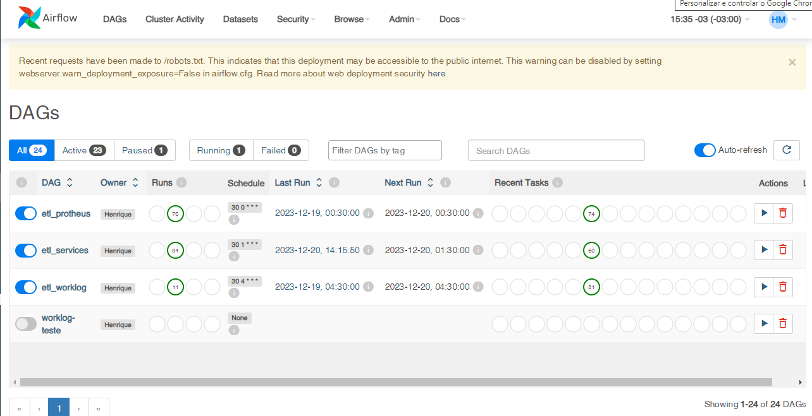
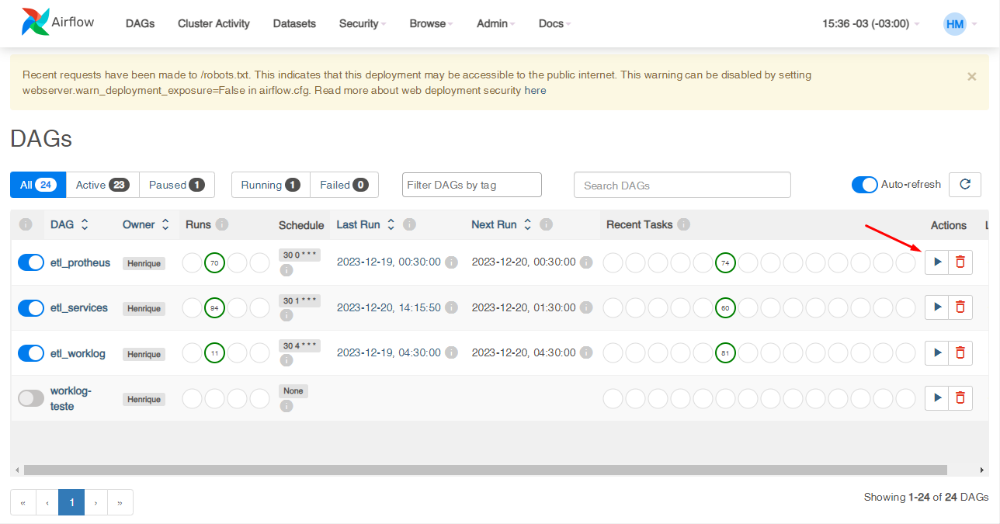
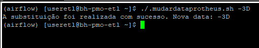

# Documentação para Reinicialização do Ambiente Airflow

Caso o Airflow não esteja sendo reconhecido no servidor indicado [http://10.171.32.76:8080/home](http://10.171.32.76:8080/home), siga os passos abaixo. Certifique-se de estar na pasta do usuário. Em caso de dúvidas se está na pasta certa
```bash
cd ~
```

### 1. Acessar o Servidor

```bash
ssh useretl@10.171.32.76
```

### 2. Finalizar Processos do Usuário

```bash
pkill -u useretl
```
Você será desconectado, realize o login novamente para realizar as próximas ações

### 3. Limpar Arquivos Temporários

```bash
sudo rm -rf /tmp/*
sudo rm -rf /var/log/*
sudo rm -rf /var/cache/*
sudo yum clean all
sudo rm -rf nohup.out
```

### 4. Comando de Limpeza Automática

Utilize o seguinte comando para realizar toda a limpeza automaticamente:

```bash
limparlogs
```

### 5. Iniciar Ambiente Virtual do Airflow

```bash
af
```

Após executar este comando, o prompt deve ser alterado para indicar que está no ambiente virtual do Airflow, como mostrado abaixo:

De:
```bash
[useretl@bh-pmo-etl ~]$
```

Para:
```bash
(airflow) [useretl@bh-pmo-etl ~]$
```

### 6. Executar Processos do Airflow

```bash
saf
```

Este comando irá iniciar todos os processos do Airflow novamente. Verifique após 5 minutos se tudo está funcionando corretamente.

# Verificação do Status do Airflow

Para verificar se o Airflow foi iniciado corretamente, acesse [http://10.171.32.76:8080/home](http://10.171.32.76:8080/home) em seu navegador. Certifique-se de que a página está carregando corretamente.

Exemplo da Tela de Início do Airflow:

Caso seja necessário reprocessar, siga os passos abaixo:

### 1. Editar o Arquivo de Configuração

```bash
vim ~/airflow/dags/protheus.py
```

### 2. Localizar a Linha com a Data

Dentro do arquivo `protheus.py`, localize a linha que contém a variável `date` com o valor "-3D". Modifique essa linha para definir a nova data desejada, por exemplo:

```python
date = '2017-01-01'
```

Se possível, crie um script para realizar essa alteração automaticamente.

### 3. Retorno à Home do Airflow

Volte à página inicial do Airflow no navegador e aguarde alguns minutos.

### 4. Executar Processo no Airflow

Na interface do Airflow, encontre a tarefa desejada e clique no ícone de reprodução (play) ao lado dela.

Exemplo da Interface do Airflow:


### 5. Aguardar Finalização do Processo

Aguarde o término do processo. Este procedimento pode levar em média 12 horas.

### 6. Retornar Data para "-3D"

Após a conclusão do processo, retorne à edição do arquivo `protheus.py` e ajuste a data de volta para "-3D". Isso é importante para garantir a consistência nos processos futuros.

# Atualização da Data no Arquivo Protheus

Para facilitar a atualização da data no arquivo `protheus.py`, foi criado um script chamado `.mudardataprotheus.sh`. Siga os passos abaixo:

### 1. Executar Script para Atualizar a Data

Para definir uma nova data, execute o seguinte comando:

```bash
./.mudardataprotheus.sh 2017-01-01
```

Substitua "2017-01-01" pela data desejada.

### 5. Retornar Data para "-3D"

Após a conclusão do processo, retorne à edição do arquivo `protheus.py` e ajuste a data de volta para "-3D".

### Uso do Script para Mudança Automática de Data

```bash
./.mudardataprotheus.sh -3D
```
